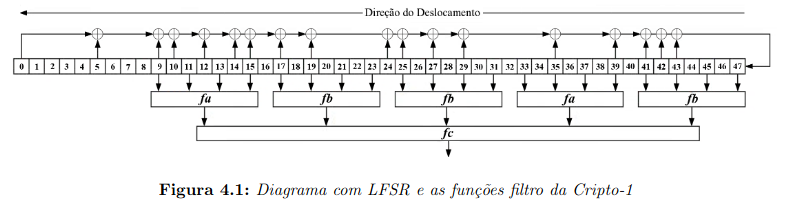
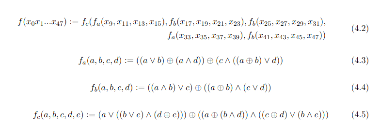

# Introduction

This is a simple implementation of the Crypto-1 cipher popularly used on 1KB and 4KB MIFARE Classic tags

I would like to thank **Wellington Baltazar de Souza** for providing his master's thesis which was and will be heavily used during the process of building this code

[Click here to read his thesis](https://www.ime.usp.br/~wbsouza/dissertacao.pdf)

# Linear-feedback shift register

# Fa, Fb and Fc functions

